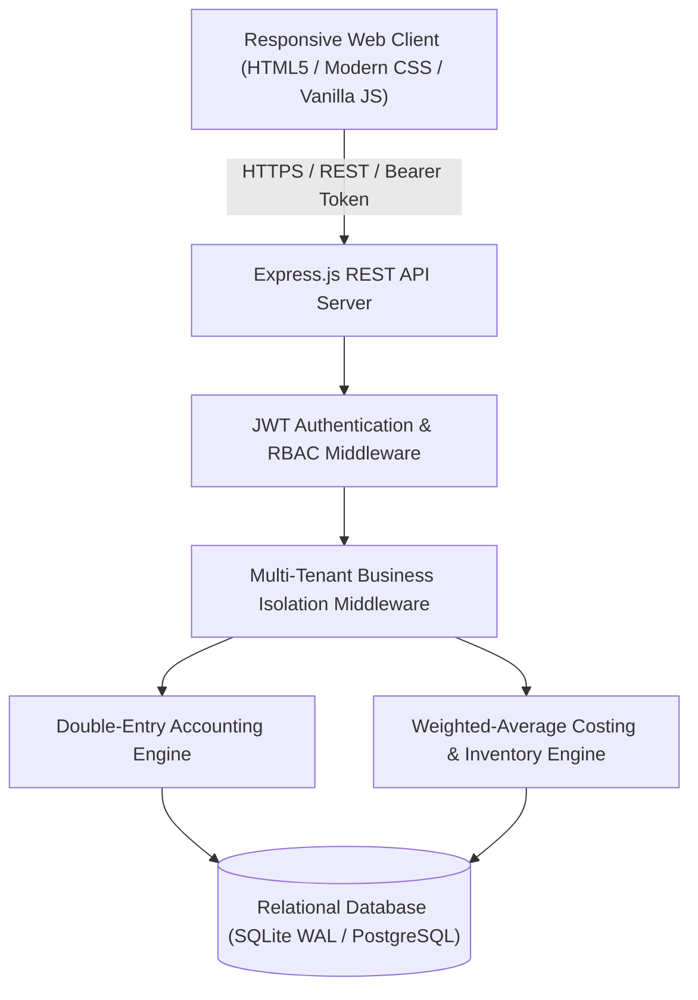

# BizBook

> **"Run your business. Know your numbers."**

BizBook is a production-grade financial and business management web application built for small and local businesses. It allows business owners without formal accounting training to record day-to-day business operations (sales, purchases, inventory, expenses, customer credit, supplier payables) while the backend automatically enforces strict **double-entry bookkeeping**, **Weighted Average Costing (WAC)**, **multi-tenant business data isolation**, and **financial statement generation** (Profit & Loss, Balance Sheet, Cash Flow, and Trial Balance).

---

## Table of Contents

1. [Key Features](#key-features)
2. [Project Architecture](#project-architecture)
3. [Folder Structure](#folder-structure)
4. [Design System & Brand Identity](#design-system--brand-identity)
5. [Database Schema & Entity Relationships](#database-schema--entity-relationships)
6. [Double-Entry Accounting Engine & Financial Logic](#double-entry-accounting-engine--financial-logic)
7. [Inventory Valuation & Weighted Average Costing](#inventory-valuation--weighted-average-costing)
8. [Multi-Business Isolation & RBAC Security](#multi-business-isolation--rbac-security)
9. [AI Business Assistant Architecture](#ai-business-assistant-architecture)
10. [REST API Documentation](#rest-api-documentation)
11. [Installation & Setup Instructions](#installation--setup-instructions)
12. [Running Tests & Verifications](#running-tests--verifications)
13. [Production Deployment Guide](#production-deployment-guide)

---

## 1. Key Features

- **Double-Entry Accounting Core**: Every financial transaction strictly enforces `Total Debits = Total Credits`. Unbalanced journal entries are rejected at the service level.
- **Weighted Average Costing (WAC)**: Automatically recalculates inventory cost upon inward purchases; locks historical COGS at the time of sale.
- **Point of Sale (POS) & Checkout**: High-speed touch interface with product catalog, search, barcode support, customer selection, payment splitting, and negative stock controls.
- **Invoicing & Printable Receipts**: Thermal 80mm printable receipts, WhatsApp sharing links, and PDF/print support.
- **Receivables & Payables (Debtors/Creditors)**: Track customer credit debt and supplier balances with FIFO payment settlement.
- **Operating Expenses**: Categorize overheads (transport, utilities, salaries, fuel, rent) with real-time budget share breakdown.
- **Financial Statements**:
  - **Profit & Loss (P&L)**: Revenue minus Cost of Goods Sold (COGS) equals Gross Profit; Gross Profit minus Operating Expenses equals Net Profit.
  - **Balance Sheet**: Assets = Liabilities + Equity verified automatically.
  - **Cash Flow Statement**: Inflows and outflows across Cash on Hand, Bank Accounts, and POS terminals.
  - **Trial Balance**: Full debit/credit reconciliation.
- **AI Business Assistant**: Answers questions like *"What were my sales this month?"*, *"Which product made me the most profit?"*, *"Who owes me money?"* using verified database records with 0% hallucination.
- **Multi-Tenant Isolation**: Rigid backend scoping ensures Business A can never access Business B's data.
- **Role-Based Access Control (RBAC)**: Supports Owner, Admin, Manager, Accountant, Cashier, and Staff roles.
- **Tamper-Evident Audit Trail**: Captures user, action, entity, before/after values, and IP addresses.

---

## 2. Project Architecture



---

## 3. Folder Structure

```
BF/
├── package.json               # Node.js project manifest & dependencies
├── .env                       # Environment secrets and runtime configuration
├── .env.example               # Template environment file
├── README.md                  # Comprehensive technical documentation
│
├── server/                    # Backend application source
│   ├── index.js               # Express server entry point & security middleware
│   ├── config/
│   │   └── database.js        # Relational DB connection (SQLite with WAL & FK pragmas)
│   ├── database/
│   │   ├── migrations.js      # Relational schema tables, constraints, and indexes
│   │   ├── seedAccounts.js    # Default Chart of Accounts & categories seeder
│   │   └── seedDemo.js        # Realistic Nigerian retail demo data seeder
│   ├── middleware/
│   │   ├── auth.js            # JWT verification & active business tenant resolver
│   │   ├── rbac.js            # Role-based access control guards
│   │   └── errorHandler.js    # Masked production error handler
│   ├── services/
│   │   ├── accountingService.js # Double-entry engine & financial statement generator
│   │   ├── inventoryService.js  # WAC calculations, movements, and stock adjustments
│   │   └── auditService.js      # System mutation audit trail logger
│   ├── controllers/
│   │   ├── authController.js    # Register, login, profile, password change
│   │   ├── businessController.js# Business creation, member management, roles
│   │   ├── productController.js # Product catalog, categories, stock adjustments
│   │   ├── salesController.js   # POS checkout, invoicing, receipt data, voiding
│   │   ├── purchaseController.js# Supplier restock orders & inventory increments
│   │   ├── customerController.js# Customer ledger, debtor balance, debt payments
│   │   ├── supplierController.js# Supplier ledger, creditor balance, disbursements
│   │   ├── expenseController.js # Operating expenses logging & categorization
│   │   ├── paymentController.js # Cash/Bank/POS liquidity balances & payment log
│   │   ├── reportController.js  # Dashboard KPIs, P&L, Balance Sheet, Cash Flow
│   │   ├── aiController.js      # Verified financial Q&A engine
│   │   └── auditController.js   # Audit trail retrieval
│   └── routes/
│       └── api.js             # Central router mapping endpoints to controllers
│
├── public/                    # Frontend client SPA assets
│   ├── index.html             # Shell layout with responsive containers
│   ├── css/
│   │   ├── style.css          # Blue-and-white design system, typography, POS
│   │   └── print.css          # Thermal 80mm & A4 print formatting
│   └── js/
│       ├── api.js             # Fetch client, JWT management, toasts, modals
│       ├── state.js           # Reactive global state store
│       ├── app.js             # Lifecycle controller & client-side router
│       └── components/
│           ├── nav.js         # Custom vector logo, sidebar, topbar, mobile nav
│           ├── dashboard.js   # Real-time KPIs, SVG sales charts, stock alerts
│           ├── pos.js         # Touch register, cart, payments, instant checkout
│           ├── sales.js       # Invoices list, receipts modal, WhatsApp sharing
│           ├── products.js    # Catalog, physical stock adjustment, categories
│           ├── purchases.js   # Restock purchase orders & supplier balance updates
│           ├── customers.js   # Customer CRM & debt payment posting
│           ├── suppliers.js   # Supplier directory & payable disbursements
│           ├── expenses.js    # Expense recording & category breakdown
│           ├── reports.js     # P&L, Balance Sheet, Cash Flow, Trial Balance
│           ├── ai.js          # AI Business Assistant chat interface
│           ├── settings.js    # Business settings, team members, audit log
│           └── auth.js        # Login, register, 7-step onboarding wizard
│
└── tests/                     # Automated test suites
    ├── accounting.test.js     # Requirement 48 financial reconciliation test
    ├── security.test.js       # Multi-tenant isolation & constraint tests
    └── api.test.js            # End-to-end REST API HTTP integration tests
```

---

## 4. Design System & Brand Identity

- **Brand Name**: **BizBook**
- **Tagline**: *"Run your business. Know your numbers."*
- **Visual Theme**: **BLUE AND WHITE**
  - **Brand Flow Blue** (`#0A58CA`): Expresses trust, financial clarity, and momentum.
  - **Deep Executive Navy** (`#0A2540`): High-contrast readability for numbers and titles.
  - **Clean Crisp White & Soft Slate** (`#FFFFFF`, `#F8FAFC`): Open space and clarity.
  - **Financial Semantic Accents**:
    - Emerald Green (`#059669`): Revenue, profits, paid transactions, cash inflow.
    - Crimson Red (`#DC2626`): Expenses, operating losses, unpaid debts, cash outflow.
    - Warm Amber (`#D97706`): Low stock alerts, partial settlements.
- **Custom Logo**: Vector SVG mark featuring intertwined growth ribbons with financial flow geometry, integrated in desktop headers, mobile navigation, receipts, and invoices.

---

## 5. Database Schema & Entity Relationships

The relational database enforces foreign key cascades, unique constraints, and check constraints:

- `users`: Credentials, full name, phone, password hash (bcrypt 12 rounds).
- `businesses`: Name, business type, currency (`NGN / ₦`), contact details, negative stock policy.
- `business_members`: Maps users to businesses with roles (`owner`, `admin`, `manager`, `accountant`, `cashier`, `staff`).
- `accounts`: Chart of Accounts per business with classification (`asset`, `liability`, `equity`, `revenue`, `expense`).
- `categories`: User-defined product categories.
- `products`: SKU, barcode, unit, cost price (WAC), selling price, current stock, reorder level.
- `inventory_transactions`: Permanent ledger recording all stock mutations (`opening_stock`, `purchase`, `sale`, `sale_return`, `purchase_return`, `damage`, `adjustment`).
- `customers`: Name, phone, email, address, outstanding debtor balance.
- `suppliers`: Vendor name, contact person, phone, email, outstanding creditor balance.
- `sales` & `sale_items`: Invoices, quantities, unit prices, unit costs, subtotal, discount, tax, total, paid, and balance amounts.
- `purchases` & `purchase_items`: Purchase orders, unit costs, quantities, and payment status.
- `expenses`: Category, amount, payment method, description, reference.
- `payments`: Centralized transaction record of all inflows and outflows.
- `journal_entries` & `journal_lines`: Double-entry accounting ledger with debit/credit balance constraint.
- `audit_logs`: User, action, entity, entity ID, before/after values, IP address.

---

## 6. Double-Entry Accounting Engine & Financial Logic

Every business operation automatically posts a balanced journal entry:

| Transaction | Debit Account | Credit Account | Effect |
| :--- | :--- | :--- | :--- |
| **Inventory Purchase (Cash)** | `1200 Inventory Asset` | `1010 Cash on Hand` | Inventory increases, Cash decreases |
| **Inventory Purchase (Credit)** | `1200 Inventory Asset` | `2010 Accounts Payable` | Inventory increases, Supplier debt increases |
| **Cash Sale** | `1010 Cash` & `5010 COGS` | `4010 Sales Revenue` & `1200 Inventory` | Cash & Revenue increase; Stock & Cost recognized |
| **Credit Sale** | `1100 Accounts Receivable` & `5010 COGS` | `4010 Sales Revenue` & `1200 Inventory` | Customer owes money; Stock & Cost recognized |
| **Customer Payment** | `1010 Cash / 1020 Bank` | `1100 Accounts Receivable` | Cash increases, Customer debt decreases |
| **Supplier Payment** | `2010 Accounts Payable` | `1010 Cash / 1020 Bank` | Supplier debt decreases, Cash decreases |
| **Operating Expense** | `60xx Specific Expense` | `1010 Cash / 1020 Bank` | Operating cost recorded, Cash decreases |
| **Physical Stock Loss (Shrinkage)** | `6110 Misc Loss` | `1200 Inventory Asset` | Inventory reduced to match physical count |

### Profit Calculations
$$\text{Gross Profit} = \text{Revenue} - \text{Cost of Goods Sold (COGS)}$$
$$\text{Net Profit} = \text{Gross Profit} - \text{Operating Expenses}$$

---

## 7. Inventory Valuation & Weighted Average Costing

BizBook uses **Weighted Average Cost (WAC)** to preserve historical profitability:

$$\text{New Cost Price} = \frac{(\text{Current Stock} \times \text{Current Cost}) + (\text{Purchase Quantity} \times \text{Purchase Unit Cost})}{\text{Current Stock} + \text{Purchase Quantity}}$$

When goods are sold, the `cost_price` at that exact moment is saved permanently in `sale_items.unit_cost`. Subsequent supplier price changes never distort past profit reports.

---

## 8. Multi-Business Isolation & RBAC Security

1. **Multi-Tenant Scoping**: All queries filter by `WHERE business_id = ?`. The active `business_id` is verified on the backend by querying the user's verified business membership in `business_members`. Client-supplied IDs are never trusted blindly.
2. **Role-Based Permissions**:
   - `owner`: Full control over business, financial settings, and team.
   - `admin`: All operational features and user management.
   - `manager`: Sales, purchases, inventory, products, expenses.
   - `accountant`: Financial statements, reports, expenses, chart of accounts.
   - `cashier`: POS sales creation and customer debt collection only.
   - `staff`: Product lookup and sale entry.
3. **Security Protections**:
   - Protection against SQL injection via parameterized queries.
   - Rate limiting on authentication routes (100 requests per 15 minutes).
   - Bcrypt password hashing (12 salt rounds).
   - Secure HTTP headers configured via Helmet.

---

## 9. AI Business Assistant Architecture

The AI Business Assistant is built on **deterministic, verified ledger queries**:
- Never hallucinates figures.
- Parses business inquiries (e.g. *"What were my sales this month?"*, *"Which product made me the most profit?"*, *"Who owes me money?"*, *"Why is my profit lower this month?"*).
- Directly queries the SQL database and accounting engine aggregates.
- Formats executive-grade explanations citing exact numbers and currencies.

---

## 10. REST API Documentation

All protected routes require `Authorization: Bearer <jwt_token>` and optional `x-business-id: <id>`.

| Method | Endpoint | Description | Role Required |
| :--- | :--- | :--- | :--- |
| `POST` | `/api/auth/register` | Register a new user | Public |
| `POST` | `/api/auth/login` | Sign in & receive JWT | Public |
| `GET` | `/api/auth/me` | Fetch user profile & businesses | Authenticated |
| `POST` | `/api/businesses` | Create and initialize business | Authenticated |
| `GET` | `/api/businesses/current` | Get business details & members | Authenticated |
| `PUT` | `/api/businesses/current` | Update business settings | Owner, Admin |
| `GET` | `/api/products` | Search & filter products | Cashier+ |
| `POST` | `/api/products` | Create product with stock | Manager+ |
| `POST` | `/api/products/:id/adjust-stock`| Adjust physical stock count | Manager+ |
| `GET` | `/api/sales` | List completed sales | Staff+ |
| `POST` | `/api/sales` | Create POS sale & deduct stock | Cashier+ |
| `POST` | `/api/sales/:id/void` | Void sale & reverse ledger | Owner, Admin |
| `POST` | `/api/purchases` | Record supplier restock | Manager+ |
| `GET` | `/api/customers` | Customer list & debtor balances | Cashier+ |
| `POST` | `/api/customers/:id/payments` | Record customer debt payment | Cashier+ |
| `POST` | `/api/suppliers/:id/payments` | Pay supplier accounts payable | Accountant+ |
| `POST` | `/api/expenses` | Log business operating expense | Cashier+ |
| `GET` | `/api/reports/dashboard` | Dashboard KPIs & sales trends | Authenticated |
| `GET` | `/api/reports/pnl` | Profit & Loss Statement | Accountant+ |
| `GET` | `/api/reports/balance-sheet` | Balance Sheet Statement | Accountant+ |
| `GET` | `/api/reports/cash-flow` | Cash Flow Statement | Accountant+ |
| `POST` | `/api/ai/ask` | AI Financial Intelligence Q&A | Authenticated |
| `GET` | `/api/audit` | System audit trail logs | Owner, Admin |

---

## 11. Installation & Setup Instructions

### Prerequisites
- [Node.js](https://nodejs.org/) version 18 or higher.
- npm (Node Package Manager).

### Quickstart
```bash
# 1. Install dependencies
npm install

# 2. Configure environment variables (defaults work out of the box)
cp .env.example .env

# 3. (Optional) Seed realistic Nigerian retail demo data
npm run seed

# 4. Start the application
npm start
```

Open your browser at: **`http://localhost:5000`**

### Demo Credentials
If you ran `npm run seed`, you can sign in immediately with:
- **Email**: `demo@BizBook.ng`
- **Password**: `BizBook123`
*(Or click the "Login with Adeleke Provisions Demo Data" button on the login screen!)*

---

## 12. Running Tests & Verifications

Run the complete automated test suite:
```bash
npm test
```

This runs:
1. **`tests/accounting.test.js`**: Verifies Requirement 48 end-to-end accounting reconciliation (100 opening units @ ₦8,500; 50 purchased @ ₦8,500; 10 sold @ ₦9,500; ₦50,000 paid; ₦20,000 transport expense; checks 140 remaining units, ₦95k revenue, ₦85k COGS, ₦10k gross profit, -₦10k net profit, ₦45k debtor balance, and balanced debit/credit sums).
2. **`tests/security.test.js`**: Verifies multi-business isolation, negative stock prevention, and accounting debit/credit imbalance prevention.
3. **`tests/api.test.js`**: Verifies all HTTP REST endpoints, POS checkout, stock reductions, and AI Q&A responses.

---

## 13. Production Deployment Guide

1. Set `NODE_ENV=production` in your hosting environment (e.g. Render, Railway, AWS EC2, DigitalOcean).
2. Generate a secure, high-entropy `JWT_SECRET` string.
3. BizBook automatically runs relational schema migrations upon startup.
4. If using a process manager:
   ```bash
   pm2 start server/index.js --name "BizBook"
   ```
5. Ensure the persistent data directory (`./data/`) is mounted to a persistent disk volume on containerized platforms.

---

*BizBook — Run your business. Know your numbers.*
